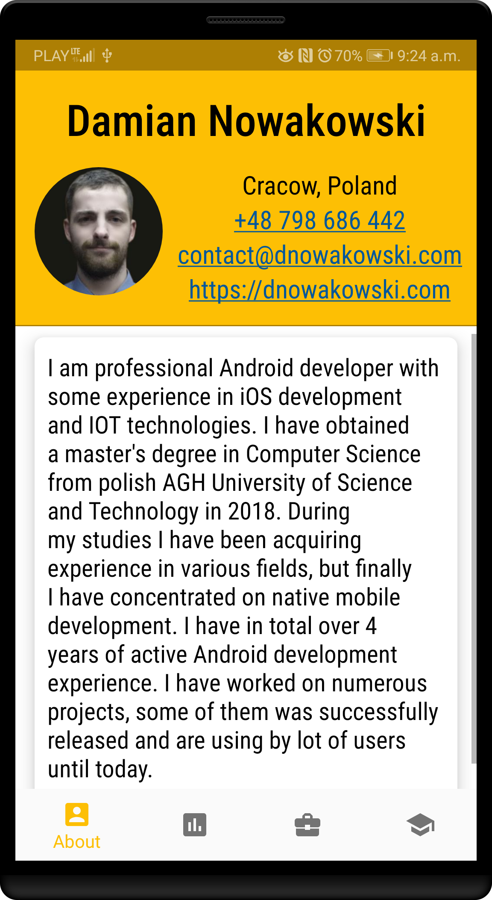
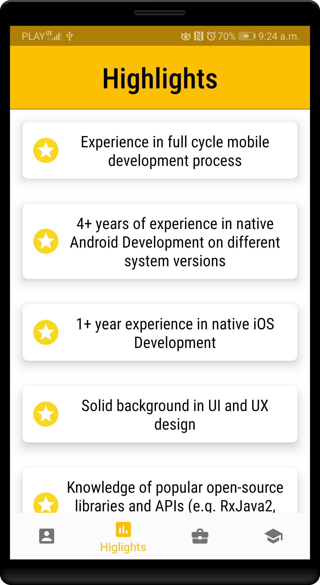
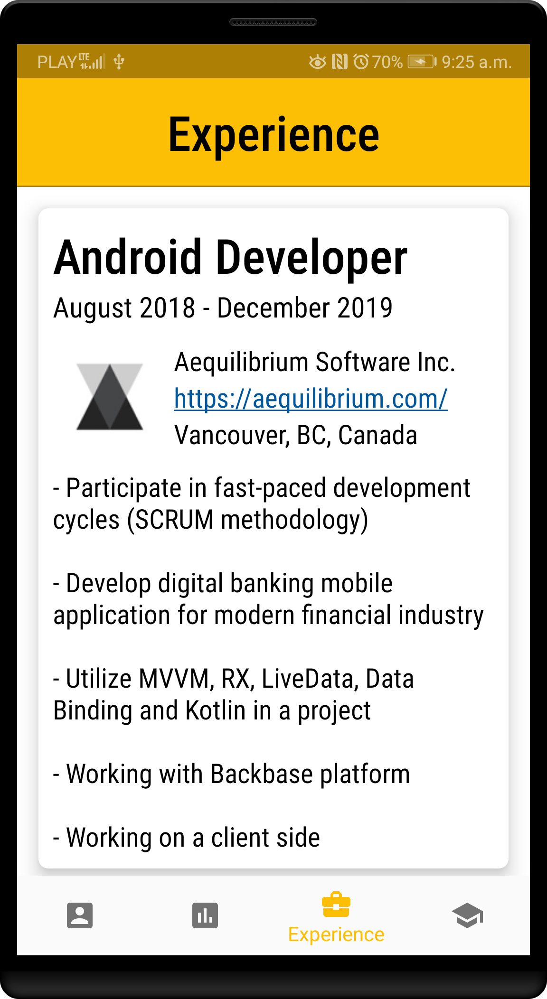
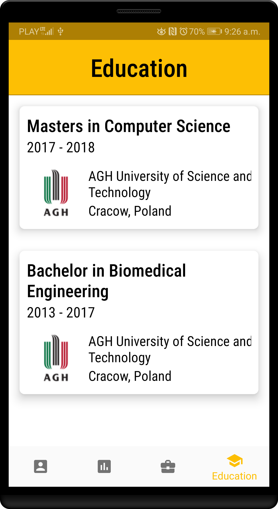

# eResume
My CV example app for HSBC (Kraków, Poland division) recruitment process purposes. Unfortunately, used architecture has been too hard to understand for their team, so they just gave a short feedback that this project is "(...)difficult to read, debug and test" and they rejected me without any further explenations. Thanks HSBC, really professional approach.

The architecture had been based on [this article](https://medium.com/aeqdigital/reactive-programming-with-mvvm-for-mobile-apps-9d5476f9ecc7).

The development has been approached as a production code and some extra configuration have been made:
- Proguard configuration (only for the release build type)
- Gradle signing configuration (only for the release build type)
- Firebase Crashlytics installed (google-services.json not present in the public repository)
- Log scope limitation for the release version
- Launcher icon created
- Unit tests added

Some key solutions/technologies used in the app:
- MVVM architecture
- RxJava/RxKotlin
- Databinding
- Livedata
- Lottie
- Glide
- Retrofit

